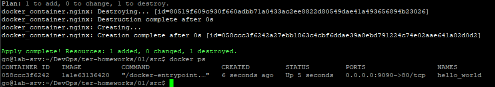

#  Домашнее задание к занятию «Введение в Terraform»

------

### Чек-лист готовности к домашнему заданию


------

### Задание 1

1. Скачиваем все необходимые зависимости, использованные в проекте.


2. Изучение файла .gitignore.
Согласно документации Terraform, файлы для описания значений переменных  имеют расширение .tfvars
В данном файле .gitignore, личную, секретную информацию (логины, пароли, ключи, токены) допустимо сохранять в personal.auto.tfvars

3. Выполнение кода проекта и поиск секрета в state-файле


4. Исправление ошибок в коде
После выполнения команды terraform validate получаем сообщение об ошибках


    - Отсутсвует имя ресурса в main.tf строка 23,
    Все блоки ресурсов должны иметь 2 метки (тип, название).
   
    - Неверное имя ресурса в main.tf строка 28,
    Имя должно начинаться с буквы или символа подчеркивания и может содержать
    только буквы, цифры, знаки подчеркивания и тире.

5. Исправленный фрагмент кода и вывод команды docker ps


6. Замена имени docker-контейнера в блоке кода на ```hello_world```

    - Опасность применения ключа  ```-auto-approve```
        - Дословный перевод - ```автоматическое одобрение``` ,  что подразумевает выполнение изменений без запроса подтверждения у пользователя. Это может привести к нежелательным изменениям в production-среде (удаление инфрастуктуры, пересоздание ресурсов) без возможности отмены.
    - Зачем может пригодиться данный ключ
        - Тестовые окружения
            - Автоматическое создание/удаление dev‑ или staging‑сред, где потеря данных не критична.
        - CI/CD‑пайплайны
            - После этапа ```terraform plan```, где изменения явно проверены и одобрены (например, через ревью MR/PR).
            - В пайплайнах, где ```terraform apply -auto-approve``` запускается только после успешного прохождения тестов.
        - Автоматизированные задачи
            - Скрипты для регулярного обновления некритичных ресурсов (например, тегов или метаданных).
            - Операции, где изменения детерминированы и безопасны.
        - Отладка
            - Быстрое тестирование небольших изменений в локальной среде.
            - Только если инфраструктура легко восстанавливается
            
7. Уничтожение ресурсов

8. Объяснение, почему при выполнении команды ```terraform destroy``` не был удалён docker-образ nginx:latest
   - В коде файла main.tf при описании ресурса ```docker_image``` указан параметр ```keep_locally = true```
   - Подтверждение из документации: 
        - keep_locally (Boolean) If true, then the Docker image won't be deleted on destroy operation. If this is false, it will delete the image from the docker local storage on destroy operation.
        - [Ссылка на документацию](https://library.tf/providers/kreuzwerker/docker/latest/docs/resources/image#optional)

### Задание 2*

     [Финальный код](main.tf)

### Задание 3*
